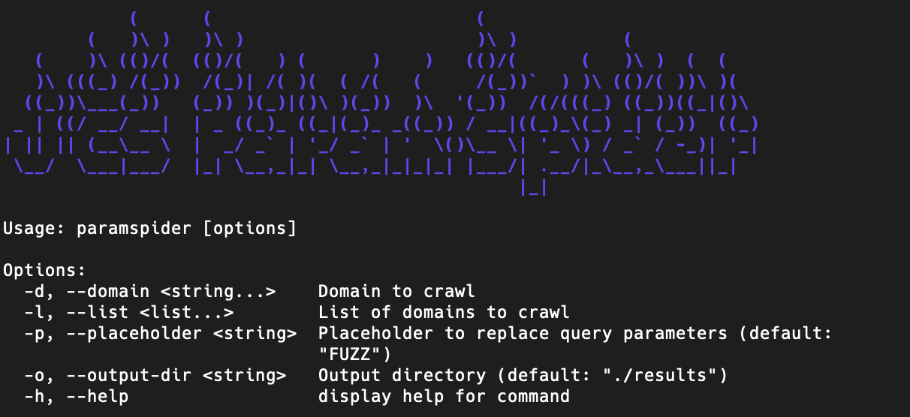

# Bun Parameter Spider

Bun Parameter Spider is a powerful tool for discovering HTTP GET parameters in web applications. It leverages Web Archive (Wayback Machine) data to capture unique HTTP GET parameters from web applications. This ensures comprehensive discovery of historical parameters for analysis and testing.



---

## Features

- Multi-domain support
- Output results to a specified directory
- Lightweight and easy to use
- Flexible execution: via `bun link` or manual usage with `index.ts`

---

## Installation

1. Ensure you have [Bun](https://bun.sh) installed on your system.
2. Clone the repository:

```bash
$ git clone https://github.com/binsarjr/paramspider
$ cd paramspider
```

3. Install dependencies:

```bash
$ bun install
```

4. Link the tool globally (optional):

```bash
$ bun link
```

---

## Usage

### Using Global Command

Once linked globally, you can run the tool as:

```bash
paramspider -d <domain1> <domain2> ... -l <domain_list_file> -o <output_directory>
```

### Using `index.ts` Manually

Alternatively, you can run the tool directly with Bun:

```bash
bun run index.ts -d <domain1> <domain2> ... -l <domain_list_file> -o <output_directory>
```

### Arguments

Usage: paramspider [options]

Options:
- `-d`, `--domain <string...>`    : Domain to crawl (e.g., `example.com domainku.com`).
- `-l`, `--list <list...>`        : (Optional) Path to a file containing a list of domains.
- `-p`, `--placeholder <string>` : Placeholder to replace query parameters (default: `"FUZZ"`).
- `-o`, `--output-dir <string>`  : Output directory (default: `"./results"`).
- `-h`, `--help`                 : Display help for command.

### Example

#### Using Global Command

```bash
paramspider -d example.com domainku.com -l domainlist.txt -o output_dir/result
```

#### Using `index.ts`

```bash
bun run index.ts -d example.com domainku.com -l domainlist.txt -o output_dir/result
```

This command crawls `example.com` and `domainku.com`, reads additional domains from `domainlist.txt`, and saves the results in the `output_dir/result` directory.

---

## Output

The tool generates:

- A list of unique HTTP GET parameters discovered during the crawl.
- Separate files for each domain containing their respective parameters.

---

## Contributing

Feel free to contribute to the project by submitting pull requests or reporting issues. Make sure to follow the standard coding guidelines and include detailed descriptions in your contributions.

---

## License

This project is licensed under the [MIT License](LICENSE).

